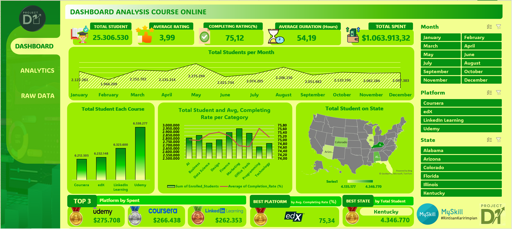
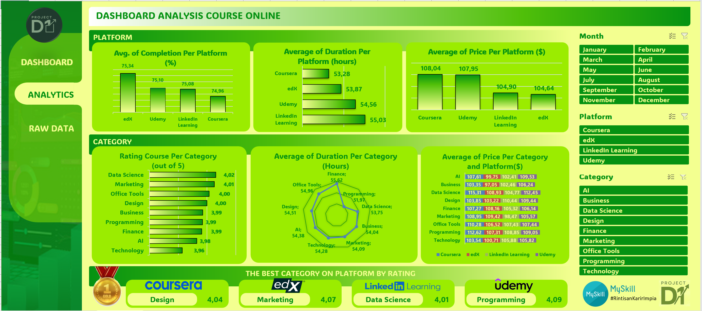
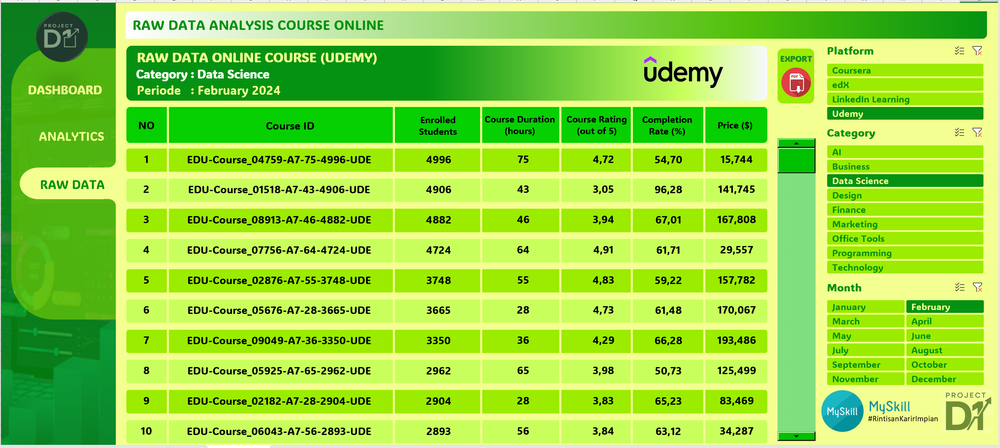

# 📊 Dashboard Analysis Course Online
# 📌 Project Overview
This project presents an Interactive Dashboard Analysis for Online Courses, developed using Microsoft Excel. The dashboard aims to analyze online course performance across multiple platforms by providing insights into student enrollment, course ratings, completion rates, pricing, and spending behavior.
The project is designed with three main dashboard views to support data exploration, performance analysis, and transparency of raw data, making it suitable for business intelligence, data analytics, and decision-making purposes.

# 🛠️ Tools & Technologies
## Microsoft Excel
- Pivot Tables
- Pivot Charts
- Power Query
- Slicers & Filters
- Data Visualization

- Dataset: Online Course Data (Multi-platform)

# 🎯 Project Objectives

- Analyze online course performance across different e-learning platforms.
- Compare student engagement, completion rates, and course pricing.
- Identify top-performing platforms, categories, and regions.
- Provide clear and interactive insights for stakeholders.

# 📂 Dashboard Structure
The dashboard consists of three main views:

## 1️⃣ Dashboard Overview (Main Performance Dashboard)

This view presents a high-level summary of overall course performance with key performance indicators (KPIs) and interactive visualizations.
### 📌 Key Metrics Displayed:
- Total Students
- Average Course Rating
- Average Completion Rate (%)
- Average Course Duration (Hours)
- Total Spending

### 📊 Visual Analysis Includes:

- Total Students per Month
Displays enrollment trends throughout the year to identify seasonality.
- Total Students per Platform
Comparison between Coursera, edX, LinkedIn Learning, and Udemy.
- Total Students & Average Completion Rate per Category
Combines volume and engagement quality across categories.
- Geographical Analysis (Total Students per State)
Highlights regions with the highest participation.
- Top 3 Platforms by Spending
Shows platforms generating the highest total revenue.
- Best Platform & Best State
Identifies top performers based on completion rate and total students.

✅ This dashboard helps stakeholders quickly understand overall performance and strategic highlights.

## 2️⃣ Analytics Dashboard (Platform & Category Insight)

This view focuses on comparative analysis across platforms and course categories, emphasizing quality, duration, and pricing.
### 📌 Platform-Level Analysis:

- Average Completion Rate per Platform (%)
- Average Course Duration per Platform (Hours)
- Average Price per Platform ($)

### 📌 Category-Level Analysis:

- Average Course Rating per Category
- Average Course Duration per Category
- Average Course Price per Category

### 🏆 Best Category by Rating on Each Platform:

- Coursera → Design
- edX → Marketing
- LinkedIn Learning → Data Science
- Udemy → Programming

✅ This dashboard supports pricing strategy, content optimization, and category performance evaluation.

## 3️⃣ Raw Data View (Detailed Transactional Data)

This view provides full transparency of the dataset, allowing users to explore detailed course-level information.
### 📌 Information Displayed:

- Course ID
- Enrolled Students
- Course Duration (Hours)
- Course Rating
- Completion Rate (%)
- Course Price ($)
- Platform & Category
- Monthly Period

### 🔎 Features:

- Filter by Platform, Category, and Month
- Export-ready structured table
- Supports data validation and audit processes

✅ This view ensures data traceability and validation for deeper analysis.

## 📈 Key Insights

- Udemy shows strong performance in student enrollment and total spending.
- Programming and Data Science categories consistently receive high engagement.
- Completion rates vary significantly across platforms and categories, highlighting opportunities for quality improvement.
- Monthly trends reveal peaks in student enrollment during specific periods.

## 📁 Repository Structure
📂 Dashboard-Analysis-Course-Online

 ├── Dashboard_Analysis_Course_Online (D1) - Kuntur Jalassuad
 
 ├── README.md
 
 ├── assets
 
 └── Dataset/
 
     └── Online_Course_Data.xlsx

## 🚀 How to Use

1. Download the Excel file from this repository.
2. Open using Microsoft Excel (recommended Office 365).
3. Navigate between dashboards using the sidebar menu.
4. Use slicers to explore insights dynamically.

## 📌 Author
Kuntur Jalassuad | Big Data Analytics | Data Analyst Enthusiast
- **Contact**: (Kuntur Jalassuad/ jalassuad.k@gmail.com / [LinkedIn](https://www.linkedin.com/in/kuntur-jalassuad/))

